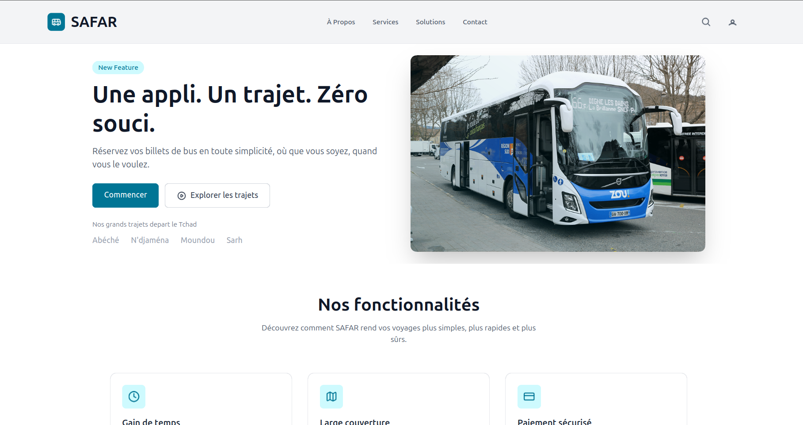

## Application Mobile de Réservation de Billets de Voyage

Cette application mobile permet aux usagers de réserver des billets de voyage (bus), de payer en ligne via Mobile Money, et de recevoir une confirmation par SMS. Elle inclut des fonctionnalités pour les usagers, les agents de gare, et les administrateurs.

---

## Fonctionnalités principales

Pour les usagers :
- Création de compte et authentification
- Recherche de trajets disponibles
- Réservation de billets
- Paiement via :
  - Airtel Money
  - Moov Money
  - Autres moyens (carte bancaire, cash en gare)
- Réception d’un SMS de confirmation
- Modification et annulation de réservations
- Consultation de l’historique

## Pour les agents de gare :
- Création de comptes pour les usagers
- Réservation et paiement au nom des usagers
- Accès aux mêmes privilèges que l’usager

Pour les administrateurs :
- Ajout/modification des trajets
- Gestion des bus et conducteurs
- Activation/désactivation d’utilisateurs
- Accès aux statistiques : réservations, annulations, revenus, etc.

---

## Stack technique 

| Côté | Technologie |
|------|-------------|
| Mobile | (ou React Native) |
| Backend API | Node.js + Express |
| Base de données | PostgreSQL (ou MongoDB) |
| Paiement | APIs Mobile Money (Airtel, Moov) |
| SMS | API Twilio ou passerelle locale |
| Authentification | JWT |
| Déploiement | Docker / Render / Heroku |

---
## Structure du projet 
/src
├── assets/                    # Images, icônes, logos
├── components/               # Composants réutilisables
│   ├── Features.tsx
│   ├── Footer.tsx
│   ├── Header.tsx
│   ├── Hero.tsx
│   └── Sidebar.tsx
├── layouts/                  # Layouts globaux
│   ├── MainLayout.tsx
│   └── SidebarLayout.tsx
├── pages/                    # Pages de l'application
│   └── Dashboard.tsx
├── App.tsx                   # Composant racine (point d'entrée JSX)
├── App.css                   # Style global de l'app
├── index.css                 # Fichier Tailwind CSS
├── main.tsx                  # Initialisation de React (createRoot)
├── vite-env.d.ts             # Types globaux générés par Vite

public/
├── index.html                # Fichier HTML principal

.gitignore
README.md
vite.config.ts                # Configuration de Vite
tsconfig*.json                # Configuration TypeScript
package.json                  # Dépendances du projet
postcss.config.mjs            # Config PostCSS pour Tailwind
tailwind.config.js            # Config Tailwind CSS

## Lancer l’application en local

## capture 


## 
## Code source

Le code source complet du projet est disponible ici :

➡ [Voir sur GitHub](https://github.com/ton-nom-utilisateur/nom-du-depot)


## Backend

```bash
cd brief
npm install
npm run dev
